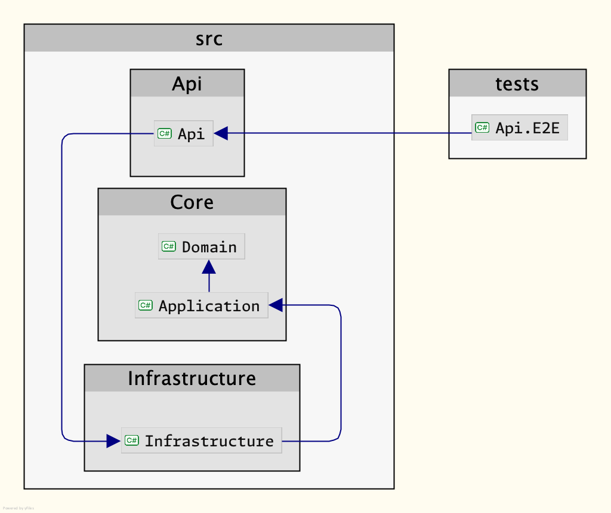

# Dotnet.Template

Hello! This is a basic template for a .NET 8 API project, which can be used as a inspirations for new projects. Using the following technologies:

- .NET 8 & C#
- Minimal APIs
- MediatR
- Entity Framework Core
- PostgreSQL
- Docker
- TestContainers
- Serilog
- FluentValidation
- FluentResults

## Architecture

I do not claim this is the "correct way" to architect an API, please feel free to suggest improvements or changes. I hope this template is useful to you!

The architecture is based on the Clean Architecture, and the project is divided into the following layers:

- Api (presentation-layer, and entry point for the application)
- Application (business logic)
- Domain (domain models)
- Infrastructure (database, caching, etc.)

The application also uses the mediator-pattern when communicating between the Api and Application-layer in a de-coupled manner. This is achieved by using the MediatR library. The functional side of this means that the application is divided into commands and queries (see `AddForecastCommand` and `GetForecastQuery`), and the business logic is implemented in handlers (see same folders are command/queries).

### Dependency graph

As can be seen, in the solution Api depends upon Infrastructure, which depends upon the core Application and Domain projects. But in essence Api only does this as the entry point of the application, which is responsible for composing everything through `DependencyInjection`. Other than that, Api should use nothing from Infrastructure, and only depend on Application and Domain.

## Getting started

### Prerequisites

- [.NET SDK 8](https://dotnet.microsoft.com/en-us/download)
- [Docker](https://www.docker.com/products/docker-desktop)

### Development

1. Clone this repository on your local machine
1. In the `src/Api` directory of the cloned repository, run `sh setup-jwts.sh`. This command will set up the necessary local JWTs required to communicate with the API. 2. _Note: The script must be run from the same OS/Virtualization as the application will be running from (because of access to dotnet user-secrets)_.
1. Start the API by running the following command in the terminal: `dotnet run --project src/Api/Api.csproj`. Alternatively, you can run the project from your favorite IDE.
1. Once the API is running, open `http://localhost:5062/swagger/` in your web browser to access the Swagger UI.
1. To authenticate with the API, you will need a JWT token that is printed when you run `setup-jwts.sh`. Paste this token into the Swagger UI to start using the API. If you need to retrieve the token again, you can run `dotnet user-jwts print <id of the token>` from the `src/Api` folder.

**Important**: For local development, if `TestContainers:Enabled` is set to `true` in the `appsettings.Development.json`-file (it is by default), the Api will start a PostgreSQL database in a Docker container using TestContainers. This means that Docker must be running when starting the Api.

### Testing

Important: The tests require Docker to be running.

1. Run the tests by running the following command in the terminal: `dotnet test` (or run the tests from your favorite IDE).

The tests are E2E-tests, which means the Api will be actually running in-memory by use of WebApplicationFactory. And a PostgreSQL database will be started in a Docker container using the TestContainers-library. This means the database will be started, and migrations run against it, and the database will be removed when the tests are done.

For each individual test, the database will be reset to a clean state using the Respawn-library.

#### Api

Folder: `src/Api`

##### Routes

The API uses Minimal APIs in this project. The API is configured in `Program.cs` and the routes are defined in the `Routes` folder.

Each group of routes has its own folder, and each endpoint under a group of routes has its own file.

So for the `/weather`-group of routes, you will find the group definition under `Routes/Weather/WeatherGroup.cs`, and the endpoints under `Routes/Weather/Endpoint/GetForecast.cs` and `Routes/Weather/Endpoint/PostForecast.cs`.

In addition any request or response models are defined in the `Models` folder. For example, the request model for the `AddForecast`-endpoint is defined in `Models/Weather/Models/PostWeatherRequest.cs`.

##### Authentication and Authorization

The API uses JWTs for authentication and authorization. The JWTs are validated using the `JwtBearer`-middleware.

The Authorization-policies is set per group of routes or individual endpoints as one chooses, and is defined in the `WeatherGroup.cs`-file.

The policies are defined in the `Authorization/ApiAuthorizationPolicy.cs`-file and added when configuring the services in `Program.cs`.
